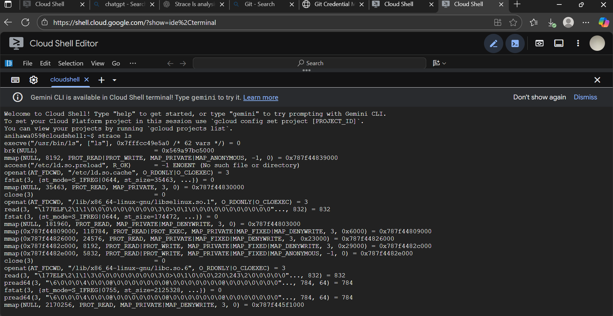
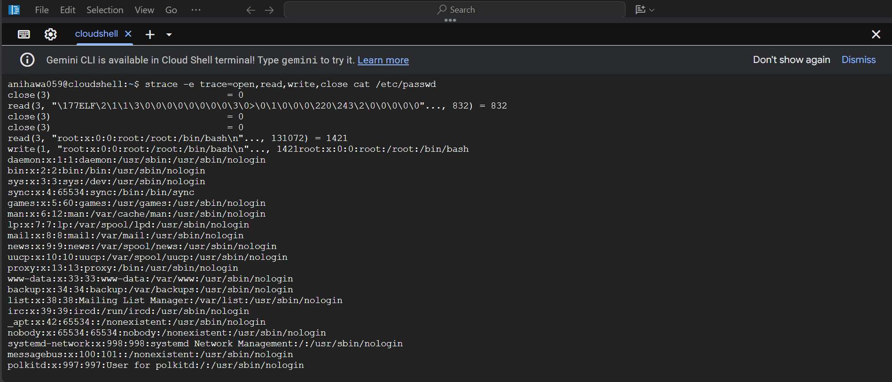
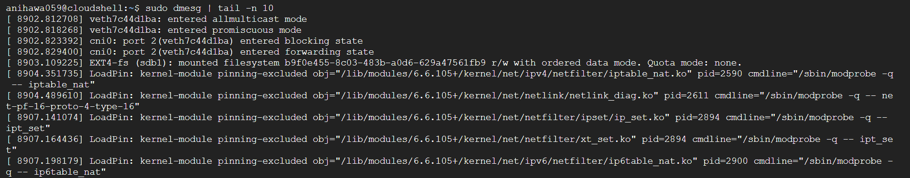
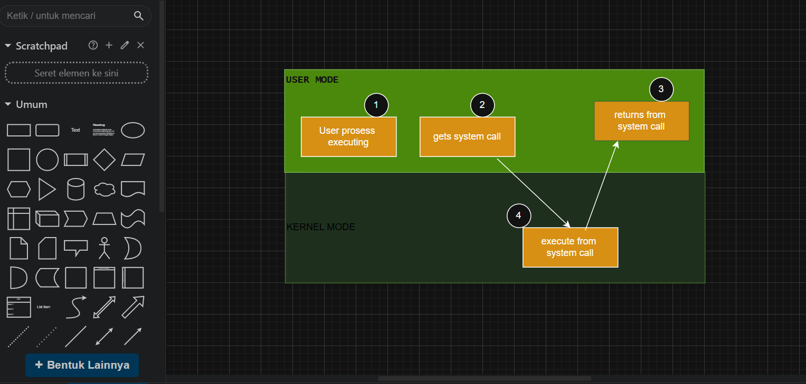

# Laporan Praktikum Minggu [2]
Topik: [Syscall Structures]

---

## Identitas
- **Nama**  : [Ani Ngismatul Hawa]  
- **NIM**   : [250202914]  
- **Kelas** : [1IKRB]

---

## Tujuan
1. Menjelaskan konsep dan fungsi system call dalam sistem operasi.
2. Mengidentifikasi jenis-jenis system call dan fungsinya.
3. Mengamati alur perpindahan mode user ke kernel saat system call terjadi.
4. Menggunakan perintah Linux untuk menampilkan dan menganalisis system call.

---

## Dasar Teori
1. berfungsi sebagai gerbang kontrol akses yang mencegah program pengguna mengakses sumber daya sensitif secara langsung.
System call berperan penting dalam menjaga keamanan sistem operasi melalui beberapa mekanisme utama. Pertama, kontrol akses memastikan bahwa aplikasi tidak dapat secara langsung mengakses file, perangkat keras, atau sumber daya sistem lainnya. Semua akses harus dilakukan melalui system call seperti read(), write(), atau open(), dan kernel akan memeriksa izin berdasarkan hak akses pengguna serta kebijakan keamanan sistem sebelum mengizinkan operasi tersebut. Kedua, terdapat validasi parameter, di mana kernel akan memverifikasi setiap argumen yang dikirim oleh aplikasi saat melakukan system call. Langkah ini mencegah aplikasi mencoba mengakses memori yang tidak sah atau memanipulasi data penting milik sistem. Selanjutnya, pemisahan hak istimewa diterapkan dengan membedakan antara mode pengguna (user mode) dan mode kernel (kernel mode). Aplikasi berjalan dalam mode pengguna dengan hak akses terbatas, sementara kernel memiliki kendali penuh terhadap perangkat keras dan sumber daya sistem. Agar dapat melakukan operasi yang memerlukan hak istimewa, aplikasi harus memintanya melalui system call, dan kernel akan menanganinya dengan aman. Terakhir, mekanisme ini juga berfungsi sebagai pencegahan gangguan antarproses. Dengan mengontrol semua permintaan terhadap sumber daya melalui kernel, system call mencegah satu program mengganggu program lain atau merusak sistem secara keseluruhan, sehingga meningkatkan stabilitas dan keamanan sistem operasi.
2. Sistem operasi (OS) memastikan transisi yang aman antara mode pengguna (user mode) dan mode kernel (kernel mode) dengan menggunakan serangkaian mekanisme yang didukung oleh perangkat keras (hardware). Proses ini memastikan bahwa aplikasi pengguna yang tidak terpercaya tidak dapat mengakses atau memodifikasi sumber daya sistem yang sensitif, seperti perangkat keras dan memori inti, sehingga menjaga stabilitas dan keamanan sistem secara keseluruhan. 
3. `open()`, `read()`, `write()` ,`close()` ,`fork()` , `exit()`

---

## Langkah Praktikum
1. Setup Environment

Gunakan Linux (Ubuntu/WSL).
Pastikan perintah strace dan man sudah terinstal.
Konfigurasikan Git (jika belum dilakukan di minggu sebelumnya).
Eksperimen 1 – Analisis System Call Jalankan perintah berikut:

strace ls
Catat 5–10 system call pertama yang muncul dan jelaskan fungsinya.
Simpan hasil analisis ke results/syscall_ls.txt.

Eksperimen 2 – Menelusuri System Call File I/O Jalankan:

strace -e trace=open,read,write,close cat /etc/passwd
Analisis bagaimana file dibuka, dibaca, dan ditutup oleh kernel.

Eksperimen 3 – Mode User vs Kernel Jalankan:

dmesg | tail -n 10
Amati log kernel yang muncul. Apa bedanya output ini dengan output dari program biasa?

Diagram Alur System Call

Buat diagram yang menggambarkan alur eksekusi system call dari program user hingga kernel dan kembali lagi ke user mode.
Gunakan draw.io / mermaid.
Simpan di:
praktikum/week2-syscall-structure/screenshots/syscall-diagram.png
Commit & Push

git add .
git commit -m "Minggu 2 - Struktur System Call dan Kernel Interaction"
git push origin main
---

## Kode / Perintah
Tuliskan potongan kode atau perintah utama:
```Hasil observasi system call (strace ls) dimasukkan ke dalam laporan.md.
File screenshot hasil observasi disimpan di screenshots/syscall_ls.png.
Diagram alur system call disimpan di screenshots/syscall-diagram.png.
Laporan lengkap berada di laporan.md.
Semua hasil telah di-commit ke GitHub tepat waktu.
```

---

## Hasil Eksekusi
Sertakan screenshot hasil percobaan atau diagram:
### 1.Eksperimen 1- Analisis system call (menjalankan perintah "Strace Ls")


|No | System call | fungsi |
|:---| :--- |:---|
|1  | execve("/usr/bin/ls", ["ls"], 0x7ffd88dff500 /* 62 vars */) = 0 | Menjalankan program baru |
|2  | brk(NULL) = 0x5a12aec0d000 | Mengambil alamat akhir dari heap |
|3 | mmap(NULL, 8192, PROT_READ|PROT_WRITE, MAP_PRIVATE|MAP_ANONYMOUS, -1, 0) | Membuat mapping memori baru di ruang alamat proses — di sini untuk stack internal atau data runtime. |
|4 | access("/etc/ld.so.preload", R_OK) = -1 ENOENT | Mengecek apakah `file /etc/ld.so ` `preload ada dan dapat dibaca. |
|5| openat(AT_FDCWD, "/etc/ld.so.cache", O_RDONLY|O_CLOEXEC) = 3 | Membuka `file /etc/ld.so.cache` yang berisi cache lokasi library dinamis agar lebih cepat ditemukan. |
|6| fstat(3, {st_mode=S_IFREG|0644, st_size=35463, ...}) = 0 | Mendapatkan informasi tentang file yang baru dibuka (file descriptor 3). |
|7| mmap(NULL, 35463, PROT_READ, MAP_PRIVATE, 3, 0) | Melakukan memory mapping `file /etc/ld.so.cache` ke memori agar bisa dibaca langsung tanpa `read()` manual.| 
|8| close(3) = 0 | Menutup file descriptor 3 setelah tidak digunakan lagi. |
|9| openat(AT_FDCWD, "/lib/x86_64-linux-gnu/libselinux.so.1", O_RDONLY|O_CLOEXEC) = 3| Membuka library dinamis `libselinux.so.1`, salah satu dependensi `ls` |
|10| read(3, "\177ELF\2\1\1\0...", 832) = 832 | Membaca header ELF (Executable and Linkable Format) dari file library tadi untuk memastikan formatnya benar dan mengetahui bagian mana yang perlu dimuat ke memori | 







---


## Analisis
- Fungsi strace ls adalah Fungsi strace ls

1. Menampilkan semua system call yang dipanggil oleh ls
Misalnya: `open()`, `read()`, `write()`, `stat()`, `close()`
Ini menunjukkan bagaimana ls bekerja “di balik layar” ketika membaca isi direktori dan menulis hasilnya ke terminal.

2. Membantu debugging
Jika suatu program tidak berjalan seperti yang diharapkan (misalnya tidak bisa membuka file), strace bisa menunjukkan di mana kesalahan terjadi.

3. Memantau file dan resource yang diakses program
Kamu bisa melihat file konfigurasi, library, atau path mana saja yang dicoba dibuka oleh ls.

4. Mempelajari cara kerja internal program
Berguna untuk keperluan pendidikan, reverse engineering, atau analisis performa.

- Fungsi strace -e trace=open,read,write,close cat /etc/passwd

Perintah strace -e trace=open,read,write,close cat /etc/passwd berfungsi untuk memantau aktivitas input-output dasar (buka, baca, tulis, tutup) yang dilakukan oleh program cat saat menampilkan isi file /etc/passwd.
Ini membantu memahami mekanisme system call I/O antara user space dan kernel.

- Fungsi dmesg | tail -n 10

Perintah dmesg | tail -n 10 berfungsi untuk menampilkan 10 pesan terakhir dari log kernel Linux, biasanya digunakan untuk memantau aktivitas sistem terbaru atau mendiagnosis masalah perangkat keras dan kernel.

---

## Kesimpulan
1. untuk menyediakan jembatan yang aman dan terkontrol antara aplikasi pengguna dan kernel sistem operasi
2. untuk menjamin bahwa interaksi antara perangkat lunak dan perangkat keras berlangsung aman, stabil, serta efisien, sehingga integritas dan keandalan sistem secara keseluruhan tetap terjaga.

---

## Quiz
1. [Apa fungsi utama system call dalam sistem operasi?]  
   **Jawaban:** 
   Fungsi utama system call adalah sebagai antarmuka atau jembatan antara program pengguna (user mode) dan kernel sistem operasi (kernel mode) untuk meminta layanan dan mengelola sumber daya sistem. Ini memungkinkan program untuk melakukan operasi-operasi penting seperti manajemen proses, manajemen berkas, akses ke perangkat keras, dan komunikasi antar-proses, yang tidak dapat dilakukan secara langsung oleh program dalam mode pengguna.  
2. [Sebutkan 4 kategori system call yang umum digunakan.]  
   **Jawaban:** 
   Empat kategori umum system call adalah manajemen proses, manajemen file, manajemen perangkat, dan komunikasi antarproses. Kategori ini mencakup fungsi-fungsi penting seperti membuat dan mengakhiri proses (manajemen proses), serta membuka, membaca, dan menulis file (manajemen file).  
3. [Mengapa system call tidak bisa dipanggil langsung oleh user program?]  
   **Jawaban:**  
   Terdapat dua alasan utama mengapa program pengguna tidak dapat memanggil system call secara langsung, yaitu untuk keamanan dan stabilitas. Program pengguna berjalan dalam mode pengguna (privilese rendah), sedangkan system call dieksekusi dalam mode kernel (privilese tinggi). 

---

## Refleksi Diri
Tuliskan secara singkat:
- Apa bagian yang paling menantang minggu ini? membutuhkan laptop yang lebih bisa untuk mengakses linux 
- Bagaimana cara Anda mengatasinya?  
membeli laptop

---

**Credit:**  
_Template laporan praktikum Sistem Operasi (SO-202501) – Universitas Putra Bangsa_
